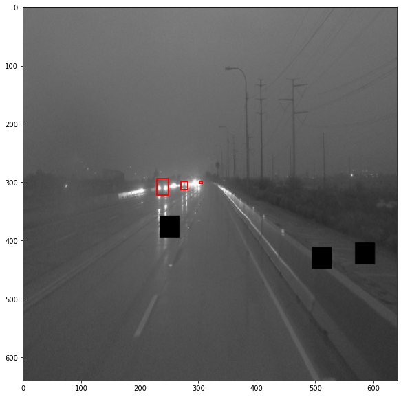
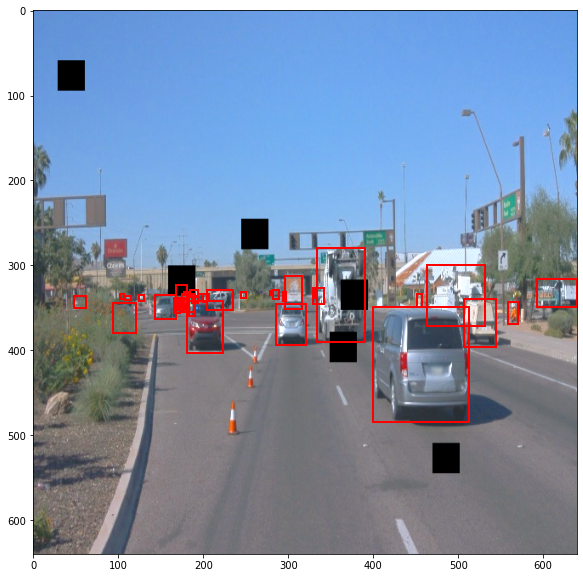
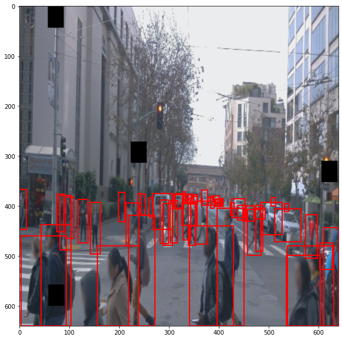
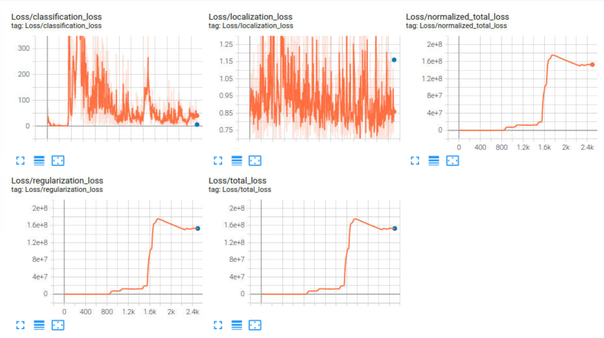
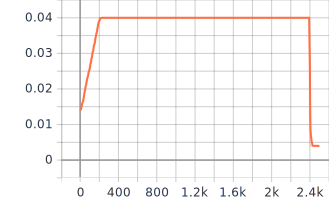
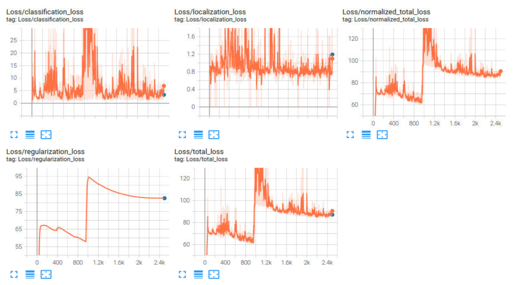
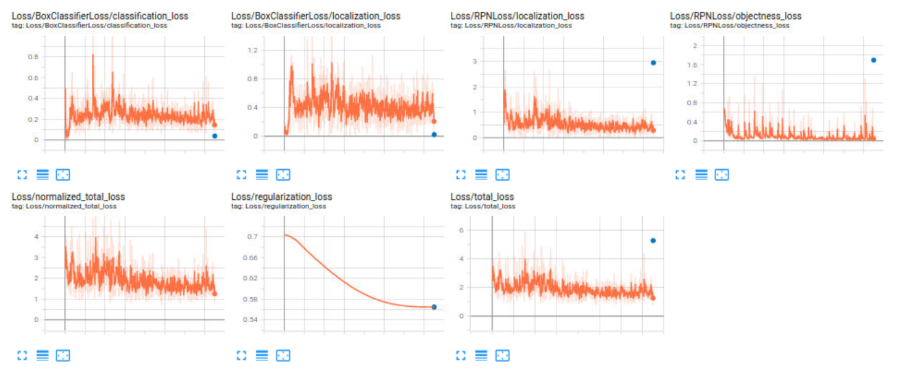

## Write-up
Results for the final project in the [Udacity](https://www.udacity.com/) Data Scientist Nanodegree program.
by **Iman Babaei**

### Project overview
I worked on this project inside my workspace at Udacity website. Data were provided from [Waymo Open dataset](https://waymo.com/open/) and already spitted in train, validation, and test folders. The aim of the project is to use a model which can correctly detect three categories inside the dataset: cars, pedestrians, and bicycles.

This is an important step in the self driving car systems because wrong detections can have fatal results or at least decrease the performance of the system.

### Set up
Steps to follow alongside this project are thoroughly described in [README file](README.md). Two pretrained models should be downloaded, [SSD Resnet 50 640x640 model](http://download.tensorflow.org/models/object_detection/tf2/20200711/ssd_resnet50_v1_fpn_640x640_coco17_tpu-8.tar.gz) and [Faster R-CNN Inception ResNet V2 640x640](http://download.tensorflow.org/models/object_detection/tf2/20200711/faster_rcnn_inception_resnet_v2_640x640_coco17_tpu-8.tar.gz). These models should be uploaded inside the `/home/workspace/experiments/pretrained_model/` folder. ``pipeline.config`` file should be modified for these models, for example number of classes reduced to 3 and so on. [pipeline.config](pipeline.config) can be used as a reference.

Then, using the commands below a new config file is made for each model:

```
python edit_config.py --train_dir /home/workspace/data/train/ --eval_dir /home/workspace/data/val/ --batch_size 2 --checkpoint /home/workspace/experiments/pretrained_model/ssd_resnet50_v1_fpn_640x640_coco17_tpu-8/checkpoint/ckpt-0 --label_map /home/workspace/experiments/label_map.pbtxt

python edit_config.py --train_dir /home/workspace/data/train/ --eval_dir /home/workspace/data/val/ --batch_size 2 --checkpoint /home/workspace/experiments/pretrained_model/faster_rcnn_inception_resnet_v2_640x640_coco17_tpu-8/checkpoint/ckpt-0 --label_map /home/workspace/experiments/label_map.pbtxt
```

Once again, the ``pipeline.config`` in the workspace directory should be **modified and specific to each model**.

After that, the ``new_pipeline.config`` must be moved to the desired folder, either reference or experiment depending on the step we are in during the project, and with the code below the model will be trained: 

```
python experiments/model_main_tf2.py --model_dir=experiments/reference/ --pipeline_config_path=experiments/reference/pipeline_new.config
```
When the model in completed, for evaluation the code snippet below can be used: 
```
python experiments/model_main_tf2.py --model_dir=experiments/reference/ --pipeline_config_path=experiments/reference/pipeline_new.config --checkpoint_dir=experiments/reference/
```

To monitor the process and see the final results of how well the model is performing:
```
python -m tensorboard.main --logdir experiments/reference/
```

After performing all the experiments with the data augmentation and changing the architecture and/or learning rate, the desired model can be saved using the code snippet below:

```
python experiments/exporter_main_v2.py --input_type image_tensor --pipeline_config_path experiments/experiment_3/pipeline_new.config --trained_checkpoint_dir experiments/experiment_3/ --output_directory experiments/experiment_3/exported/
```
Since I used 3 experiments, it is written `experiment_3` in the codes. One should change it depending on the steps and stages taken.

Finally, with the help of the saved model and using on of the TF records in the test folder, and animation file can be generated by running this code:
```
python inference_video.py --labelmap_path label_map.pbtxt --model_path experiments/experiment_3/exported/saved_model --tf_record_path data/test/segment-12200383401366682847_2552_140_2572_140_with_camera_labels.tfrecord --config_path experiments/experiment_3/pipeline_new.config --output_path animation.gif
```

### Dataset
#### Dataset analysis
To perform a quantitative and qualitative analysis of the dataset, [Exploratory Data Analysis notebook](Exploratory%20Data%20Analysis.ipynb) was used. You can refer to that for codes, and further images that are not presented here.

Below are the four images from the dataset. Cars, pedestrians, and bicycles are inside red, green, and blue boxes, respectively.

<center>


</center>

For the quantitative part of our EDA stage, I analyzed the first 90000 images of the dataset and counted the number of each object inside these photos. Below is a bar chart showing the number of each class in these 90000 images. As noticed, bicycles are rare compared to cars and pedestrians in our dataset.

<center></center>

After that, I was curious about the frequency of each class occurrences inside these 90000 images. By using `matplotlib.pyplot.hist` function, I acquired these graphs.


The highest frequency of the car class is 8 objects, in around 5.5% of the images. 50% of the images have no pedestrians and almost 90% of them do not include bicycle objects.

#### Cross validation
The data was already divided to three folders for training, evaluation, and testing for us and I used them the way they were. Global metrics (average over classes) are used to assess the models.

### Training
#### Reference experiment
First experiment, `Experiment 0`, was performed using the [pretrained SSD Resnet 50 640x640 model](https://arxiv.org/pdf/1512.02325.pdf). It can be downloaded from this [link](http://download.tensorflow.org/models/object_detection/tf2/20200711/ssd_resnet50_v1_fpn_640x640_coco17_tpu-8.tar.gz). The original config file was also modified to have batch size of 2 and access the training and evaluation data.

Loss curves from the TensorBoard for each step for the training dataset, in orange, and evaluation, in blue, can be seen below. The total losses for training and evaluation dataset are around 4.5 and 5, respectively. 

<center></center>

Below we can see the change of learning rate versus steps during the model training for Experiment 0.

<center></center>

#### Improve on the reference

As explained by the Udacity team in the [README file](README.md) we have three options to improve the reference model:

1. Improving the data augmentation strategy and choosing some methods from 39 ones available in [`preprocessor.proto`](https://github.com/tensorflow/models/blob/master/research/object_detection/protos/preprocessor.proto) for the Tf Object Detection API. Results of these augmentations can be seen in [Explore augmentations.ipynb](Explore%20augmentations.ipynb) jupyter notebook.
2. Experimenting with the optimizer: type of optimizer, learning rate, scheduler etc
3. Experimenting with the architecture. The Tf Object Detection API [model zoo](https://github.com/tensorflow/models/blob/master/research/object_detection/g3doc/tf2_detection_zoo.md), for example.

#### Experiment 01

##### Preparations
For the first improvement, I will use the below image augmentations:
* `random_horizontal_flip ` with probability = 0.5
* `random_rgb_to_gray` with probability = 0.5
* `random_adjust_brightness` and `random_adjust_contrast`
* `random_adjust_hue` and `random_adjust_saturation`
* `random_black_patches`
* `random_crop_image`

```
  data_augmentation_options {
    random_horizontal_flip {
      probability:0.5
    }
  }
  data_augmentation_options {
    random_rgb_to_gray {
      probability:0.5
    }
  }
  data_augmentation_options {
    random_adjust_brightness {
    }
  }
  data_augmentation_options {
    random_adjust_contrast {
    }
  }
  data_augmentation_options {
    random_adjust_hue {
    }
  }
  data_augmentation_options {
    random_adjust_saturation {
    }
  }
  data_augmentation_options {
    random_black_patches {
      max_black_patches: 10
      probability: 0.5
      size_to_image_ratio: 0.05
    }
  }
  data_augmentation_options {
    random_crop_image {
      min_object_covered: 0.0
      min_aspect_ratio: 0.75
      max_aspect_ratio: 3.0
      min_area: 0.75
      max_area: 1.0
      overlap_thresh: 0.0
    }
  }
```
Some of the images after these augmentations can be seen below:

<center></center>

I also changed the `cosine_decay_learning_rate` to some manual one from [this github repository](https://github.com/tensorflow/models/blob/master/research/object_detection/g3doc/tpu_compatibility.md). The code snippet is as below:

```
        manual_step_learning_rate {
          warmup: true
          initial_learning_rate: .01333
          schedule {
            step: 200
            learning_rate: 0.04
          }
          schedule {
            step: 2400
            learning_rate: 0.004
          }
        }
```
##### Results
Unfortunately the results of the first experiment was not so heartwarming and total loss has increased some orders of magnitude!! This graph shows the loss for training, in orange, and evaluation, in blue.



The learning rate graph shows how it has changed over the steps for the training process.



Since in the beginning steps we had better losses, I will use an ... 

#### Experiment 2

##### Preparations
I kept the data augmentations as before and changed only the `learning_rate` to the previous cosine decay model. 

```
      learning_rate {
        cosine_decay_learning_rate {
          learning_rate_base: 0.03999999910593033
          total_steps: 2500
          warmup_learning_rate: 0.013333000242710114
          warmup_steps: 200
        }
      }
```
##### Results
The results got better compared to the previous experiment, however still the total loss is around twenty times the reference model.




#### Experiment 3


##### Preparations 
For this improvement trial, I will experiment with the the model's architecture and try different pretrained model from the Tf Object Detection APIs available on [model zoo](https://github.com/tensorflow/models/blob/master/research/object_detection/g3doc/tf2_detection_zoo.md). I have chosen [Faster R-CNN Inception ResNet V2 640x640](http://download.tensorflow.org/models/object_detection/tf2/20200711/faster_rcnn_inception_resnet_v2_640x640_coco17_tpu-8.tar.gz) model and uploaded it in the pretrained directory of the working environment. With a tiny change in the code to make the new `pipeline.config` file as below, I performed the training.

```
python edit_config.py --train_dir /home/workspace/data/train/ --eval_dir /home/workspace/data/val/ --batch_size 2 --checkpoint /home/workspace/experiments/pretrained_model/faster_rcnn_inception_resnet_v2_640x640_coco17_tpu-8/checkpoint/ckpt-0 --label_map /home/workspace/experiments/label_map.pbtxt
```

This model takes almost 4 times longer to be trained and their checkpoints consumes almost all the memory that I encountered "No space left on device" error couple of times. Therefore, I have decreased the number of steps to 1500.

##### Results

The image below shows the loss curves obtained by this architecture.



Compared to the previous experiments, here we see lower training losses, ~ 2, and evaluation loss of 5.268. These are better results than the previous experiments and I will use this architecture to save the model and continue with the project.

Finally, below is the animation using the saved the model on one the test objects.


It can be noticed also from this animation that our model requires more improvements. Some cars in the dark and distant are not detected, also some signs are detected as cars which is obviously wrong. Two more animations are saved in the graphs folder. One is [during the day on a flat street](Graphs/animation_2.gif) and the other one is [on a curved sloppy road](Graphs/animation_3.gif). In these two animations we can see that some houses, traffic signs, and even pedestrian crossing lines are detected as cars!