## Write-up

### Project overview
This section should contain a brief description of the project and what we are trying to achieve. Why is object detection such an important component of self driving car systems?

### Set up
This section should contain a brief description of the steps to follow to run the code for this repository.

### Dataset
#### Dataset analysis
To perform a quantitative and qualitative analysis of the dataset, [Exploratory Data Analysis notebook](Exploratory%20Data%20Analysis.ipynb) was used. You can refer to that for codes, and further images that are not presented here.

Below are the four images from the dataset. Cars, pedestrians, and bicycles are inside red, green, and blue boxes, respectively.

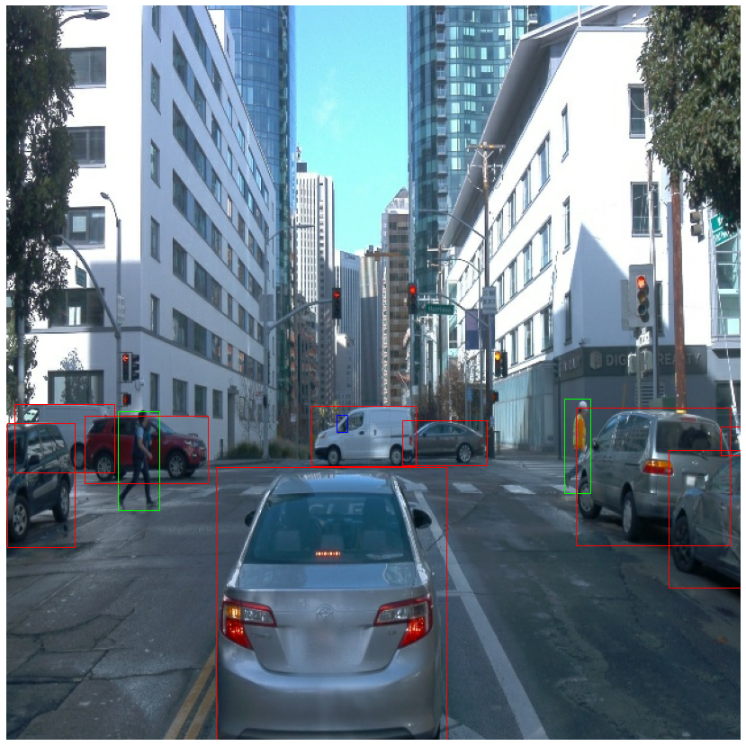
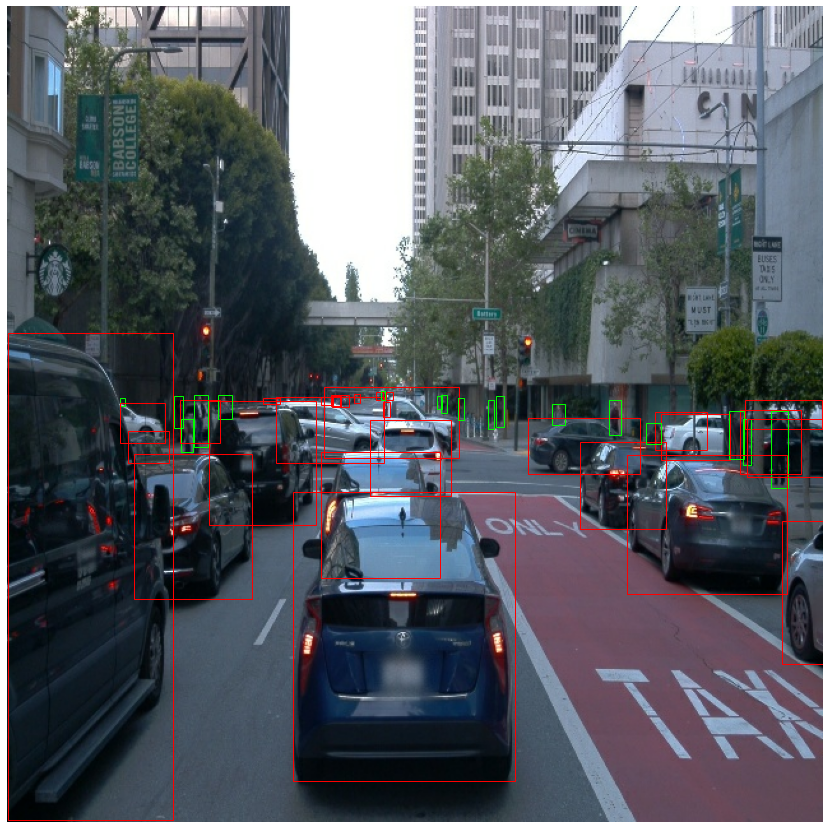
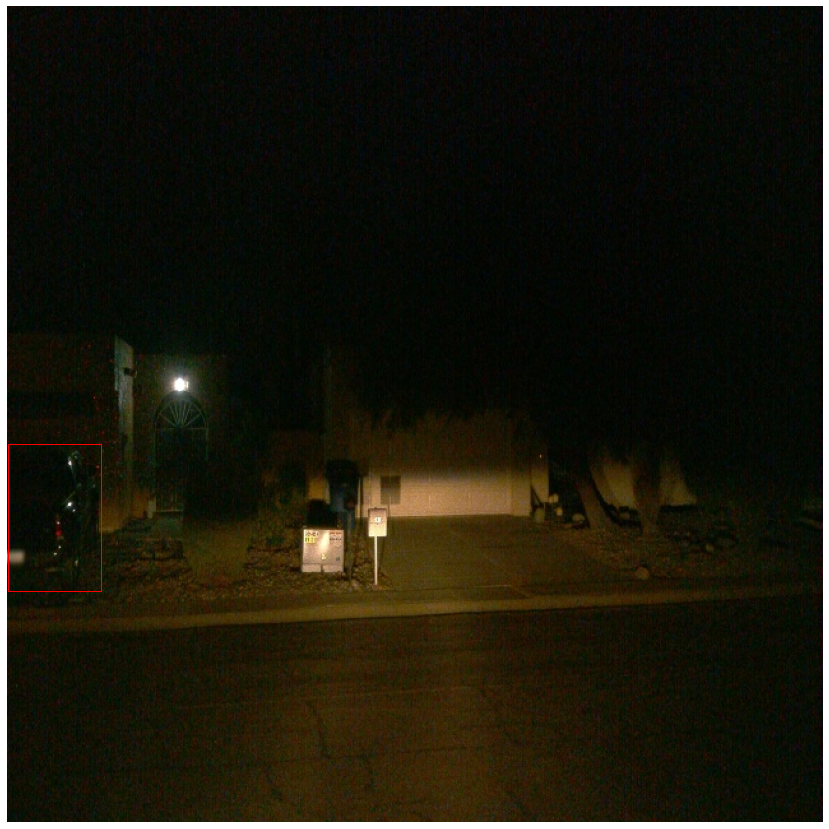
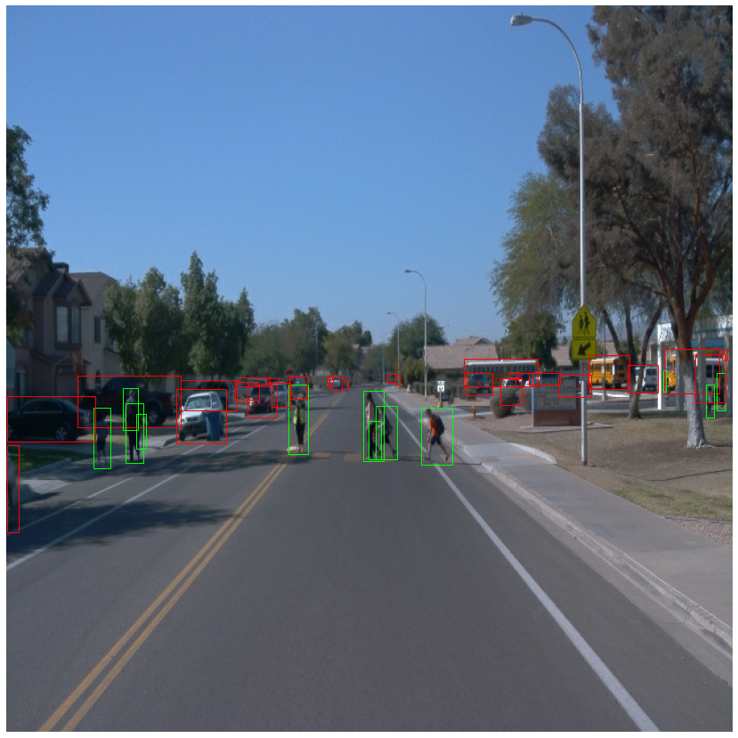

For the quantitative part of our EDA stage, I analyzed the first 90000 images of the dataset and counted the number of each object inside these photos. Below is a bar chart showing the number of each class in these 90000 images. As noticed, bicycles are rare compared to cars and pedestrians in our dataset.

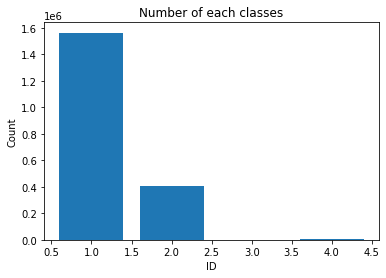

After that, I was curious about the frequency of each class occurrences inside these 90000 images. By using `matplotlib.pyplot.hist` function, I acquired these graphs.

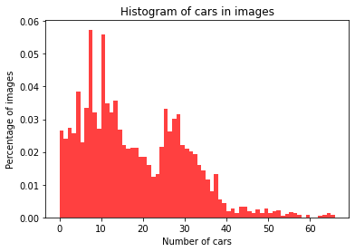
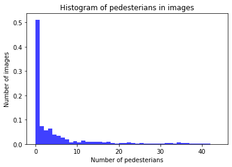
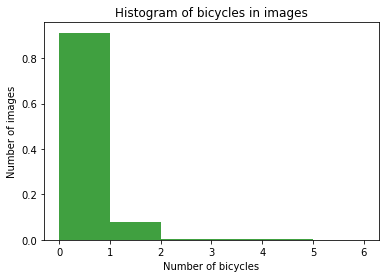

The highest frequency of the car class is 8 objects, in around 5.5% of the images. 50% of the images have no pedestrians and almost 90% of them do not include bicycle objects.

#### Cross validation
This section should detail the cross validation strategy and justify your approach.

### Training
#### Reference experiment
This section should detail the results of the reference experiment. It should includes training metrics and a detailed explanation of the algorithm's performances.
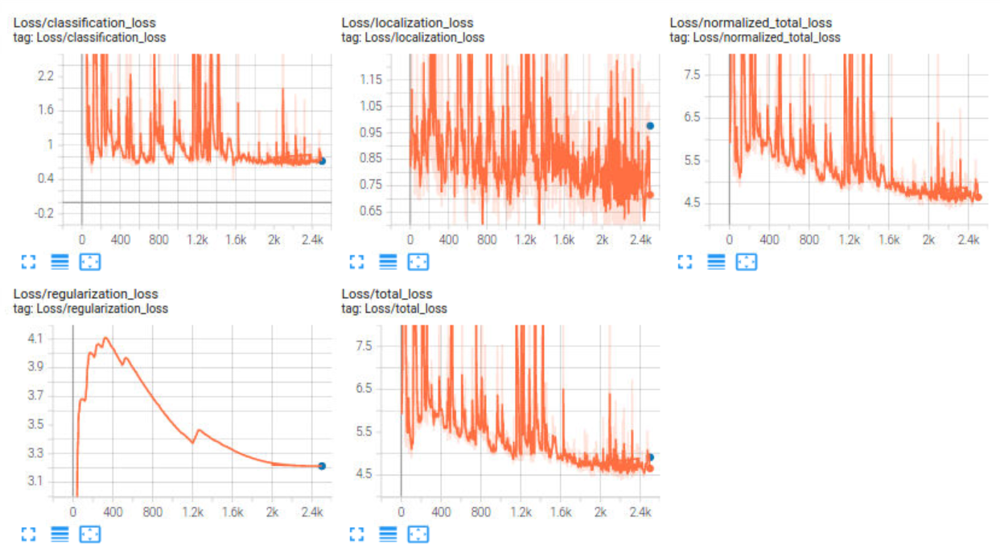
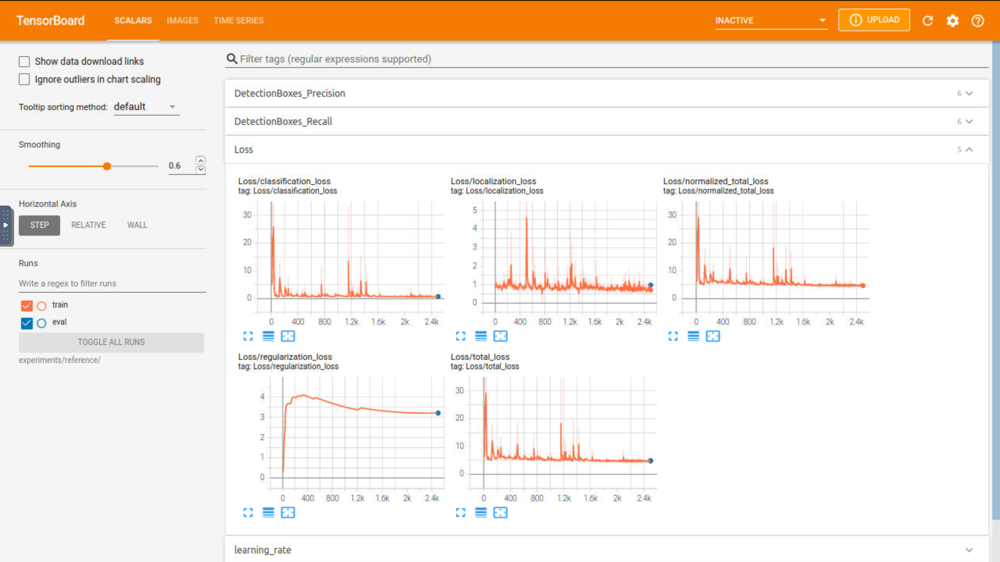

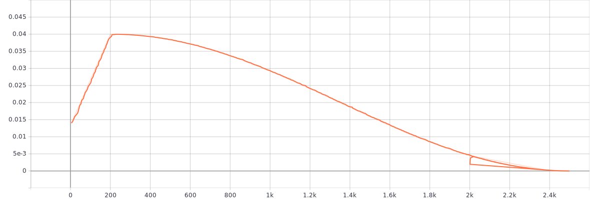

#### Improve on the reference
This section should highlight the different strategies you adopted to improve your model. It should contain relevant figures and details of your findings.
