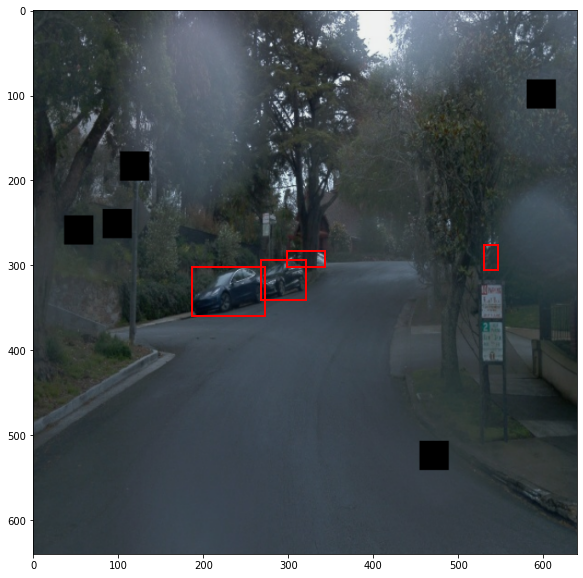

## Write-up

### Project overview
This section should contain a brief description of the project and what we are trying to achieve. Why is object detection such an important component of self driving car systems?

### Set up
This section should contain a brief description of the steps to follow to run the code for this repository.

### Dataset
#### Dataset analysis
To perform a quantitative and qualitative analysis of the dataset, [Exploratory Data Analysis notebook](Exploratory%20Data%20Analysis.ipynb) was used. You can refer to that for codes, and further images that are not presented here.

Below are the four images from the dataset. Cars, pedestrians, and bicycles are inside red, green, and blue boxes, respectively.

<center>


</center>

For the quantitative part of our EDA stage, I analyzed the first 90000 images of the dataset and counted the number of each object inside these photos. Below is a bar chart showing the number of each class in these 90000 images. As noticed, bicycles are rare compared to cars and pedestrians in our dataset.

<center></center>

After that, I was curious about the frequency of each class occurrences inside these 90000 images. By using `matplotlib.pyplot.hist` function, I acquired these graphs.


The highest frequency of the car class is 8 objects, in around 5.5% of the images. 50% of the images have no pedestrians and almost 90% of them do not include bicycle objects.

#### Cross validation
This section should detail the cross validation strategy and justify your approach.

### Training
#### Reference experiment
First experiment, `Experiment 0`, was performed using the [pretrained SSD Resnet 50 640x640 model](https://arxiv.org/pdf/1512.02325.pdf). It can be downloaded from this [link](http://download.tensorflow.org/models/object_detection/tf2/20200711/ssd_resnet50_v1_fpn_640x640_coco17_tpu-8.tar.gz). The original config file was also modified to have batch size of 2 and access the training and evaluation data.

Loss curves from the TensorBoard for each step for the training dataset, in orange, and evaluation, in blue, can be seen below. The total losses for training and evaluation dataset are around 4.5 and 5, respectively. 

<center></center>

Below we can see the change of learning rate versus steps during the model training for Experiment 0.

<center></center>

#### Improve on the reference

As explained by the Udacity team in the [README file](README.md) we have three options to improve the reference model:

1. Improving the data augmentation strategy and choosing some methods from 39 ones available in [`preprocessor.proto`](https://github.com/tensorflow/models/blob/master/research/object_detection/protos/preprocessor.proto) for the Tf Object Detection API. Results of these augmentations can be seen in [Explore augmentations.ipynb](Explore%20augmentations.ipynb) jupyter notebook.
2. Experimenting with the optimizer: type of optimizer, learning rate, scheduler etc
3. Experimenting with the architecture. The Tf Object Detection API [model zoo](https://github.com/tensorflow/models/blob/master/research/object_detection/g3doc/tf2_detection_zoo.md), for example.

#### Experiment 01

##### Preparations
For the first improvement, I will use the below image augmentations:
* `random_horizontal_flip ` with probability = 0.5
* `random_rgb_to_gray` with probability = 0.5
* `random_adjust_brightness` and `random_adjust_contrast`
* `random_adjust_hue` and `random_adjust_saturation`
* `random_black_patches`
* `random_crop_image`

```
  data_augmentation_options {
    random_horizontal_flip {
      probability:0.5
    }
  }
  data_augmentation_options {
    random_rgb_to_gray {
      probability:0.5
    }
  }
  data_augmentation_options {
    random_adjust_brightness {
    }
  }
  data_augmentation_options {
    random_adjust_contrast {
    }
  }
  data_augmentation_options {
    random_adjust_hue {
    }
  }
  data_augmentation_options {
    random_adjust_saturation {
    }
  }
  data_augmentation_options {
    random_black_patches {
      max_black_patches: 10
      probability: 0.5
      size_to_image_ratio: 0.05
    }
  }
  data_augmentation_options {
    random_crop_image {
      min_object_covered: 0.0
      min_aspect_ratio: 0.75
      max_aspect_ratio: 3.0
      min_area: 0.75
      max_area: 1.0
      overlap_thresh: 0.0
    }
  }
```
Some of the images after these augmentations can be seen below:

<center></center>

I also changed the `cosine_decay_learning_rate` to some manual one from [this github repository](https://github.com/tensorflow/models/blob/master/research/object_detection/g3doc/tpu_compatibility.md). The code snippet is as below:

```
        manual_step_learning_rate {
          warmup: true
          initial_learning_rate: .01333
          schedule {
            step: 200
            learning_rate: 0.04
          }
          schedule {
            step: 2400
            learning_rate: 0.004
          }
        }
```
##### Results
Unfortunately the results of the first experiment was not so heartwarming and total loss has increased some orders of magnitude!! This graph shows the loss for training, in orange, and evaluation, in blue.


The learning rate graph shows how it has changed over the steps for the training process.


Since in the beginning steps we had better losses, I will use an ... 

#### Experiment 2

##### Preparations
I kept the data augmentations as before and changed only the `learning_rate` to the previous cosine decay model. 

```
      learning_rate {
        cosine_decay_learning_rate {
          learning_rate_base: 0.03999999910593033
          total_steps: 2500
          warmup_learning_rate: 0.013333000242710114
          warmup_steps: 200
        }
      }
```
##### Results
The results got better compared to the previous experiment, however still the total loss is around twenty times the reference model.


#### Experiment 3


##### Preparations 
For this improvement trial, I will experiment with the the model's architecture and try different pretrained model from the Tf Object Detection APIs available on [model zoo](https://github.com/tensorflow/models/blob/master/research/object_detection/g3doc/tf2_detection_zoo.md). I have chosen [Faster R-CNN Inception ResNet V2 640x640](http://download.tensorflow.org/models/object_detection/tf2/20200711/faster_rcnn_inception_resnet_v2_640x640_coco17_tpu-8.tar.gz) model and uploaded it in the pretrained directory of the working environment. With a tiny change in the code to make the new `pipeline.config` file as below, I performed the training.

```
python edit_config.py --train_dir /home/workspace/data/train/ --eval_dir /home/workspace/data/val/ --batch_size 2 --checkpoint /home/workspace/experiments/pretrained_model/faster_rcnn_inception_resnet_v2_640x640_coco17_tpu-8/checkpoint/ckpt-0 --label_map /home/workspace/experiments/label_map.pbtxt
```

This model takes almost 4 times longer to be trained and their checkpoints consumes almost all the memory that I encountered "No space left on device" error couple of times. Therefore, I have decreased the number of steps to 1500.

##### Results

The image below shows the loss curves obtained by this architecture.


Compared to the previous experiments, here we see lower training losses, ~ 2, and evaluation loss of 5.268. These are better results than the previous experiments and I will use this architecture to save the model and continue with the project. 